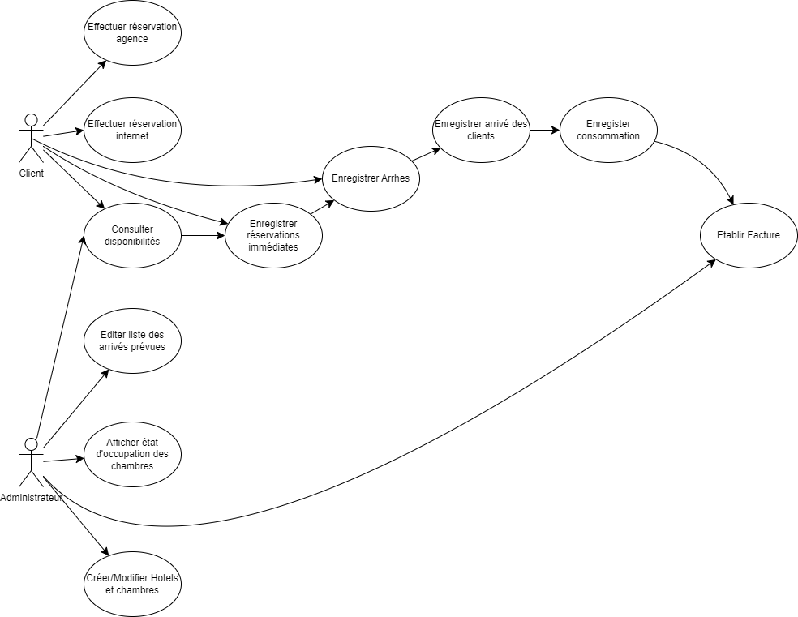
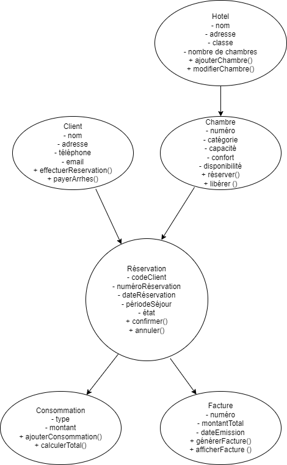
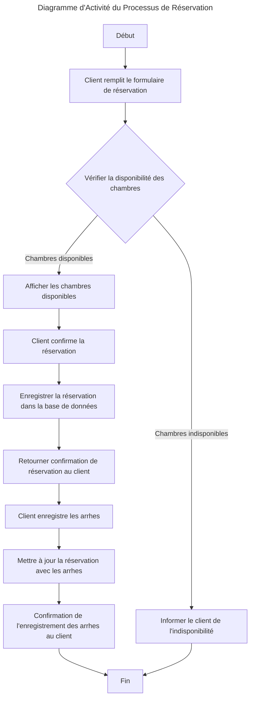
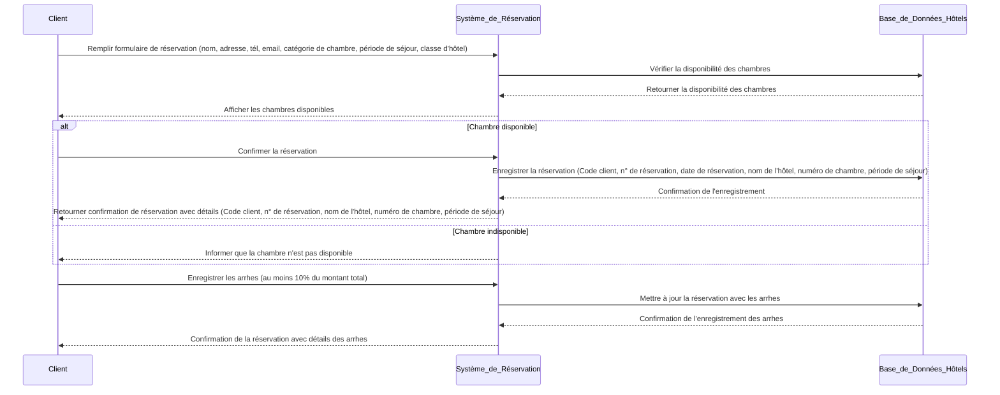

**_Atelier gestion Hôtelière_**

**Baptiste Ogerau - Boris Prince Agbodjan - Abdelhak Hammadou**

**Question 1 - Diagramme de cas d'utilisation**

**Question 2 - Diagramme de classe**

**Question 3 - Diagramme d'activité du processus de réservation**

**Question 4 - Diagramme de séquence**

