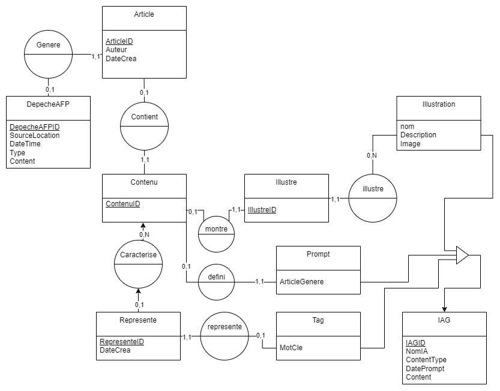

**_Atelier information automatique_**

**Baptiste Ogerau - Boris Prince Agbodjan - Abdelhak Hammadou**

**Diagramme UML**

````mermaid
erDiagram
    DepecheAFP {
        int DepecheAFPID PK
        varchar SourceLocation
        datetime DateTime
        varchar Type
        text Content
    }

    Article {
        int ArticleID PK
        text Contenu
        varchar Auteur
        date DateCrea
        int DepecheAFPID FK
    }

    Contenu {
        int ContenuID PK
        text Content
        int ArticleID FK
    }

    IAG {
        int IAGID PK
        varchar NomIA
        varchar ContentType
        date DateLastPrompt
    }

    Represente {
        int RepresenteID PK
        int IAGID FK
        int ContenuID FK
    }

    Illustre {
        int IllustreID PK
        int IllustrationID FK
        int ContenuID FK
    }

    Illustration {
        varchar Nom
        varchar Description
        blob Image
    }

    Tag {
        varchar MotCle
    }

    Prompt {
        text Article
    }


    DepecheAFP ||--o{ Article : "0,1 genere 1,1"
    Article ||--o{ Contenu : "0,1 contient 1,1"
    Contenu ||--o{ Represente : "0,N caracterise 0,1"
    Contenu ||--o{ Illustre : "0,1 illustre 1,1"
    Illustration ||--o{ Illustre : "1,N illustre 0,1"
    Tag ||--o{ Represente : "1,N herite 0,1"
    Prompt ||--o{ Contenu : "0,1 herite 1,1"
    
    IAG ||--|{ Tag : "herite"
    IAG ||--|{ Illustration : "herite"
    IAG ||--|{ Prompt : "herite"
````

**MCD**


